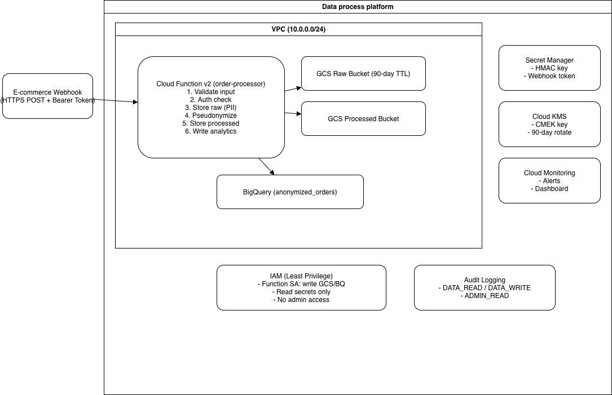

# Data Process Platform

A secure, GDPR-compliant data pipeline on Google Cloud Platform that processes e-commerce order data, pseudonymizes PII, and produces analytics-ready datasets.

## Architecture

### Data Flow

1. **Ingestion** — An HTTPS POST from the e-commerce webhook arrives at the Cloud Function endpoint with a Bearer token.
2. **Validation** — The function validates the order schema (required fields, types, format constraints).
3. **Raw Storage** — The original payload (including PII) is stored in the **raw data bucket** with a 90-day lifecycle policy.
4. **Pseudonymization** — PII fields (`email`, `name`, `address`) are hashed with HMAC-SHA256 using a key from Secret Manager. Only city/country are retained for regional analytics.
5. **Processed Storage** — The anonymized record is stored in the **processed data bucket** (365-day retention, Nearline after 90 days).
6. **Analytics** — The anonymized record is written to a BigQuery partitioned table for analytics queries.